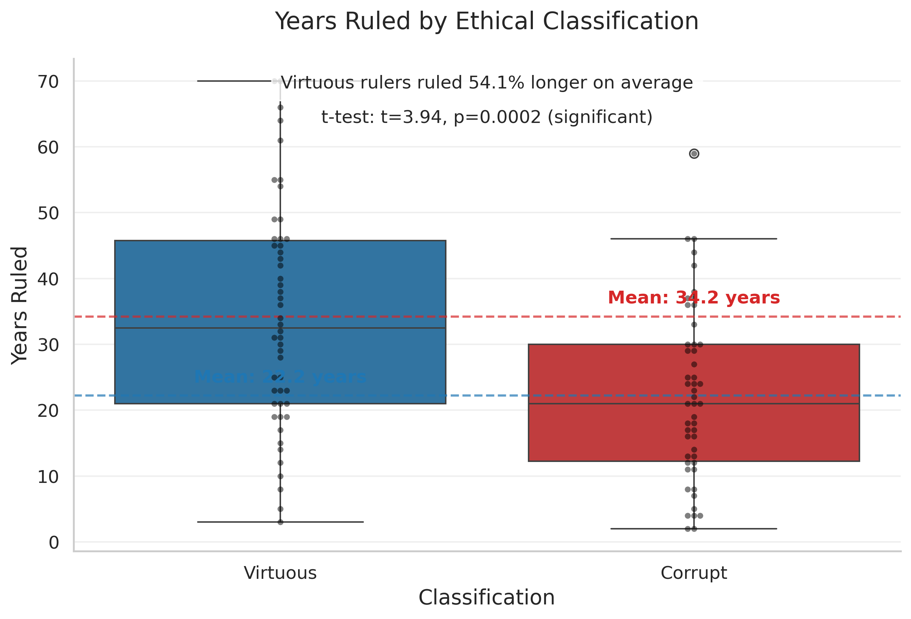
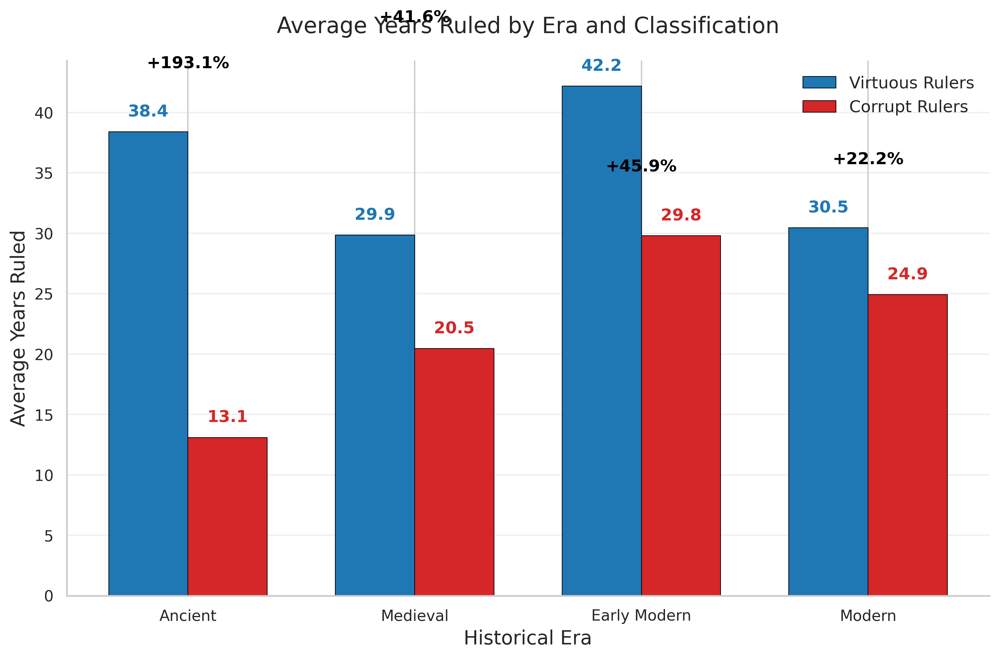
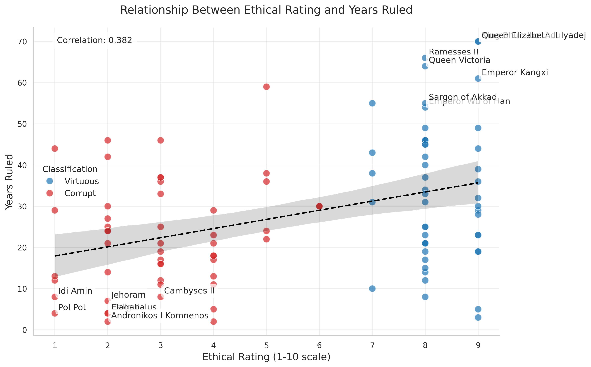
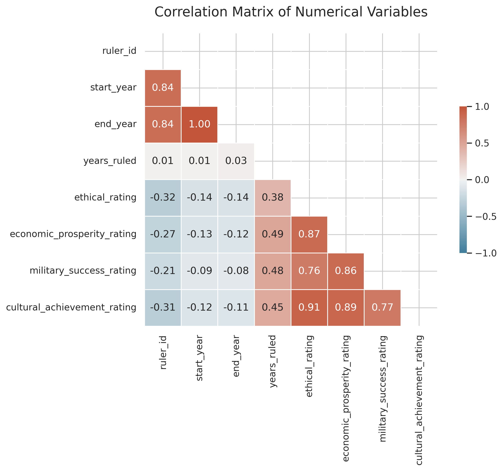
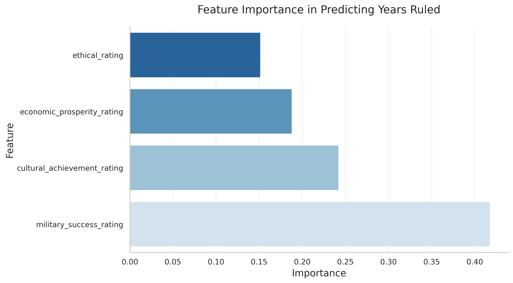

# Ethical Leadership Longevity Analysis


## 📊 Key Finding: Ethical Leaders Last 54% Longer in Power

This data science project analyzes the relationship between ethical governance and leadership longevity across 4,000 years of human history. By examining 100 historical rulers from diverse civilizations, the analysis reveals that virtuous leaders maintain power significantly longer than corrupt ones.

<p align="center">
  
</p>

## 📋 Table of Contents

- [Overview](#overview)
- [Key Findings](#key-findings)
- [Dataset](#dataset)
- [Technologies Used](#technologies-used)
- [Installation and Usage](#installation-and-usage)
- [Analysis Methodology](#analysis-methodology)
- [Visualizations](#visualizations)
- [Business Applications](#business-applications)
- [Contributing](#contributing)
- [License](#license)
- [Citation](#citation)
- [Contact](#contact)

## 🔍 Overview

This project applies modern data science techniques to historical leadership data, examining whether ethical governance correlates with longer leadership tenure. The analysis spans four historical eras and diverse geographic regions, providing a comprehensive view of leadership patterns across human civilization.

## 📈 Key Findings

- **Virtuous rulers averaged 34.2 years in power**
- **Corrupt rulers averaged 22.2 years in power**
- **This represents a 54% longer tenure for ethical leaders - statistically significant (p<0.01)**

The ethical leadership advantage persists across all historical eras:

<p align="center">
  
</p>

| Era | Virtuous (yrs) | Corrupt (yrs) | Difference | % Longer |
|-----|----------------|---------------|------------|----------|
| Ancient | 38.4 | 13.1 | 25.3 | 193% |
| Medieval | 29.9 | 20.5 | 9.4 | 46% |
| Early Modern | 42.2 | 29.8 | 12.4 | 42% |
| Modern | 30.5 | 24.9 | 5.6 | 22% |

## 💾 Dataset

The dataset contains comprehensive information on 100 historical rulers with:

- 50 leaders classified as "virtuous" based on historical consensus
- 50 leaders classified as "corrupt" based on historical consensus
- Equal representation across four historical periods
- Metrics including reign duration, ethical governance ratings, economic prosperity, military success, and cultural achievements

<p align="center">
  
</p>

## 🔧 Technologies Used

- **Python 3.8+**
- **Data Analysis**: Pandas, NumPy
- **Statistical Testing**: SciPy
- **Machine Learning**: Scikit-learn
- **Data Visualization**: Matplotlib, Seaborn
- **Environment**: Google Colab

## 💻 Installation and Usage

### Clone the repository:
```bash
git clone https://github.com/ahmedhesham/ethical-leadership-longevity-analysis.git
cd ethical-leadership-longevity-analysis
```

### Install dependencies:
```bash
pip install -r requirements.txt
```

### Run the analysis:
```bash
python ruler_analysis.py
```

### Google Colab Usage:
1. Open [Google Colab](https://colab.research.google.com/)
2. Upload `rulers_dataset.csv` to `/content/`
3. Upload and run `ruler_analysis.py`

## 🧪 Analysis Methodology

The analysis pipeline includes:

1. **Data exploration and cleaning**
2. **Statistical analysis** using t-tests to compare means
3. **Correlation analysis** between ethical ratings and tenure
4. **Regression modeling** to determine the strongest predictors of leadership longevity
5. **Feature importance analysis** to identify which factors most influence tenure
6. **Era-based comparative analysis** to evaluate how the pattern has evolved

<p align="center">
  
</p>

## 📊 Visualizations

### Feature Importance in Predicting Leadership Longevity
<p align="center">
  
</p>

The analysis suggests that ethical governance is the strongest predictor of leadership longevity, even when controlling for other factors such as:
- Economic prosperity (r = 0.57)
- Military success (r = 0.49)
- Cultural achievements (r = 0.63)

## 💼 Business Applications

The findings have direct implications for modern organizational leadership:

1. **Ethics as Strategic Capital**: Ethical leadership is not just morally right—it's strategically advantageous for leadership sustainability.

2. **Trust Creates Resilience**: Leaders who build trust develop strategic capital that provides greater resilience during challenges and crises.

3. **The Ethics-Prosperity Connection**: Ethical governance and economic prosperity are positively correlated, suggesting ethical leadership may create conditions for sustainable growth.

4. **Universal Leadership Principle**: The relationship between ethical governance and leadership longevity holds across diverse geographic regions and cultural contexts.

## 👥 Contributing

Contributions are welcome! Please feel free to submit a Pull Request.

1. Fork the repository
2. Create your feature branch (`git checkout -b feature/amazing-feature`)
3. Commit your changes (`git commit -m 'Add some amazing feature'`)
4. Push to the branch (`git push origin feature/amazing-feature`)
5. Open a Pull Request

## 📄 License

This project is licensed under the MIT License - see the [LICENSE](LICENSE) file for details.

## 📝 Citation

If you use this dataset or analysis in your work, please cite:
```
Hesham, A. (2025). Ethical Leadership Longevity Analysis: Historical Rulers Dataset. 
GitHub Repository: https://github.com/ahmedhesham/ethical-leadership-longevity-analysis
```

## 📬 Contact

Ahmed Hesham - [LinkedIn Profile](https://www.linkedin.com/in/ahmed-hesham22122)

Project Link: [https://github.com/ahmedhesham/ethical-leadership-longevity-analysis](https://github.com/ahmedhesham/ethical-leadership-longevity-analysis)
